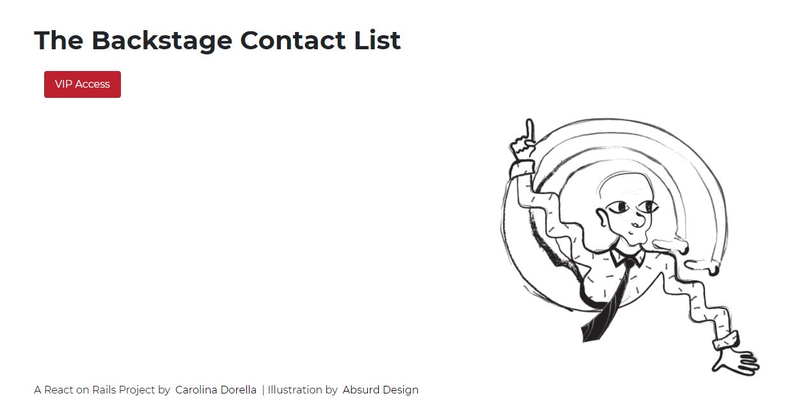

# The Backstage Contact List

A simple React on Rails CRUD contact list app, built with:

[Ruby on Rails API](https://api.rubyonrails.org/)
[Create React App](https://create-react-app.dev/)
[MySQL](https://dev.mysql.com/doc/)
[Reactstrap](https://reactstrap.github.io/)



## Setup

### Dependencies

Run `bundle install` on the root folder to install dependencies related to Rails.

`cd client` and run `yarn` to install dependencies related to React.

Client is configured so all API calls will be proxied to port 3001.

### Database Prep

In `config/database.yml` a database called "contact_list" was already added.

Create a `.env` file in the root folder of this repository and add your MySQL username and password to it:

```bash
  export DB_USER=
  export DB_PASSWORD=
```

Run `rails db:create`, `rails db:migrate` and `rails db:seed` in the root folder of this repository to create the database and populate it with some dummy data.

### Run Your Development Servers

Run Rails s -p 3001 on the root folder to start your API. You can test it in http://localhost:3001

In a separate tab, cd client and run yarn start. You can test your client app in http://localhost:3000
